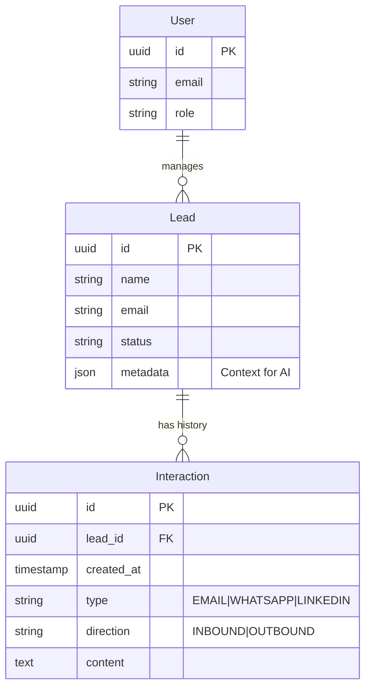
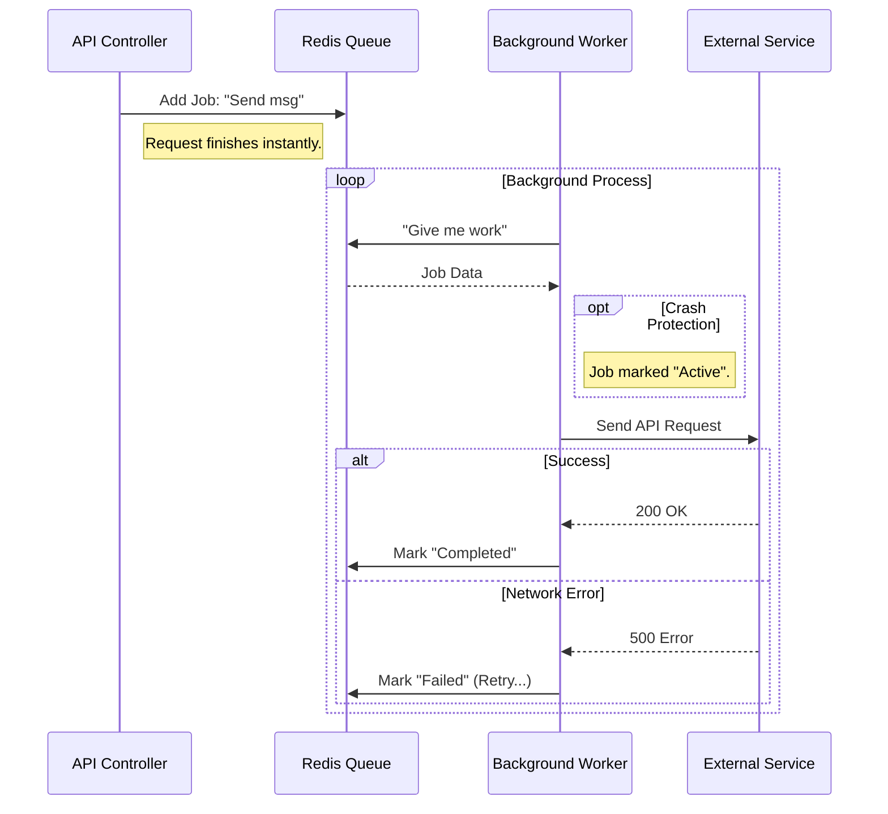
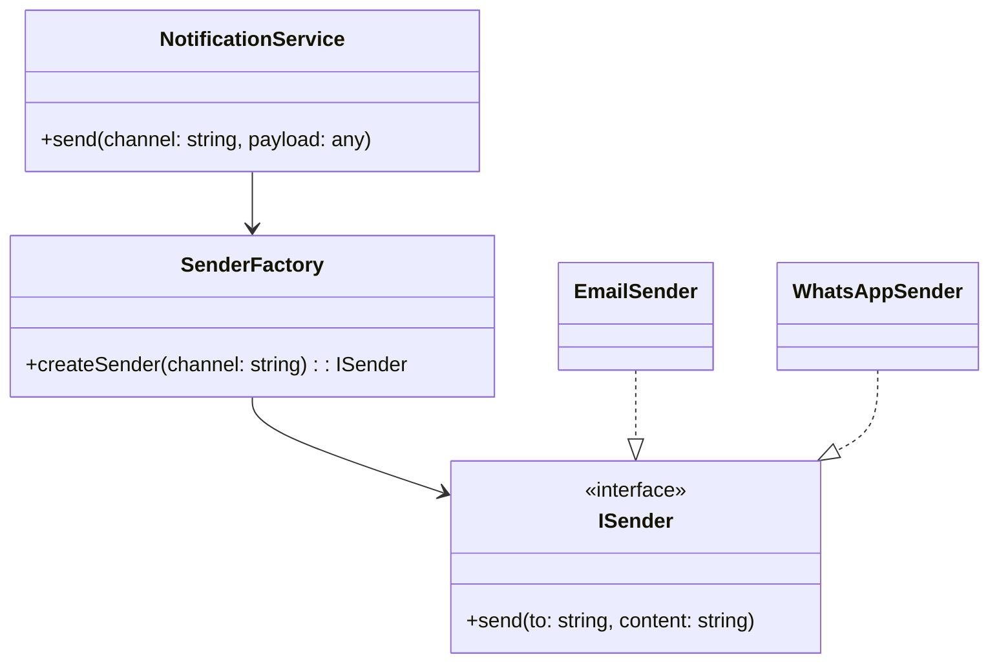
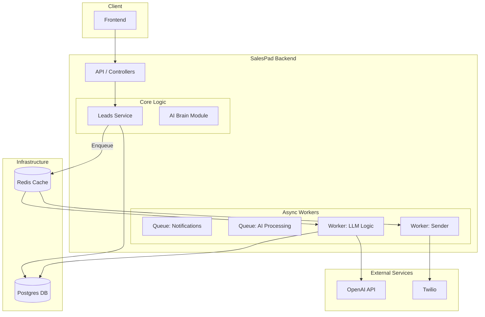

# SalesPad Architecture

## 1. System Overview

Salespad is a backend system built with **NestJS** following **Domain-Driven Design (DDD)** and **Clean Architecture** principles. We employ a **Modular Monolith** architecture to strictly separate concerns (Auth, Payments, AI) while keeping deployment simple.

The goal is to maintain decoupled, testable, and scalable code, where business logic is isolated from infrastructure details.

### Module Separation
*   **Core/Shared**: Common utilities, decorators, base classes.
*   **Leads**: Manages Lead lifecycle, timeline, and basic interactions.
*   **Auth**: Handles JWT issuance, user management, and security guards.
*   **Billing**: Interfaces with Stripe/MercadoPago. Manages subscriptions.
*   **Brain**: Encapsulates AI logic (LLM clients, prompt management, context retrieval).
*   **Notifications**: The Multichannel Engine. Handles sending messages via different providers.

---

## 2. Directory Structure

Source code is located in `src/` and organized by semantic modules (`leads`, `common`).

```
src/
├── leads/                  # Leads Module (Core)
│   ├── domain/             # Domain Layer (Entities, Repository Interfaces)
│   ├── application/        # Application Layer (Use Cases, DTOs, Services)
│   ├── infrastructure/     # Infrastructure Layer (Persistence, Queues, Adapters)
│   └── presentation/       # Presentation Layer (HTTP Controllers, Input DTOs)
├── common/                 # Shared Code (Decorators, Utilities)
├── scripts/                # Utility Scripts
└── ...
```

---

## 3. Architecture Layers

### Domain (`domain/`)
The core of the application. Contains pure business rules and depends on no other layer.
- **Entities:** Objects with identity and lifecycle (`Lead`, `Event`).
- **Repository Interfaces:** Contracts defining data access (`LeadRepository`), implemented in infrastructure.

### Application (`application/`)
Orchestrates data flow between the domain and the outside world.
- **Use Cases:** Execute specific business actions (e.g., `CreateLeadUseCase`, `SendOutboundMessageUseCase`).
- **DTOs:** Internal Data Transfer Objects.
- **Services:** Logic that doesn't belong to a specific entity or interacts with external systems (`AiMockService`).

### Infrastructure (`infrastructure/`)
Implements technical details and adapters.
- **Persistence:** Repository implementations using TypeORM (`TypeOrmLeadRepository`).
- **Queues:** Background job processors (`EmailProcessor` with BullMQ).
- **Configuration:** Database and Redis configuration modules.

### Presentation (`presentation/`)
Handles HTTP input and output.
- **Controllers:** Receive requests and delegate to Use Cases (`LeadsController`).
- **DTOs:** Define the structure of data received by the API.

---

## 4. Data Strategy

We use a dual-storage approach to ensure ACID compliance for business data and high performance for background jobs.

| Type | Technology | Purpose | Reliability Strategy |
| :--- | :--- | :--- | :--- |
| **Primary** | **PostgreSQL** | Source of Truth. Stores Leads, Users, Interaction Logs. | WAL (Write-Ahead Logging), Backups, Transactions. |
| **Ephemeral/Job** | **Redis** | Queues (BullMQ), Caching, Rate Limiting. | AOF (Append Only File) persistence. |

### Database Schema (ERD)



---

## 5. Reliability & Task Queues

To guarantee that no task (like sending an email or processing an AI response) is lost due to server crashes or API timeouts, we use **BullMQ (Redis based)**.

### The Lifecycle of a Job
1.  **Producer**: API adds a job (e.g., `SendEmailJob`) to Redis.
2.  **Persistence**: Redis persists this job to disk immediately.
3.  **Consumer**: Worker picks up the job.
4.  **Execution & Retries**:
    *   **Success**: Job marked as "Completed".
    *   **Failure**: BullMQ automatically retries with backoff strategies.
    *   **Crash**: "Stalled" jobs are detected and re-queued automatically.

### Queue Processing Flow



---

## 6. Multichannel Engine Strategy

We use the **Strategy Pattern** to handle multiple communication channels (WhatsApp, Email, LinkedIn) uniformly.

### Design Pattern
*   **`IMessageSender` Interface**: Defines `sendMessage(to, content)`.
*   **Concrete Strategies**: `EmailSender`, `WhatsAppSender`, `LinkedInSender`.
*   **Factory**: Selects the appropriate sender at runtime based on the channel.



---

## 7. System Integration Map


